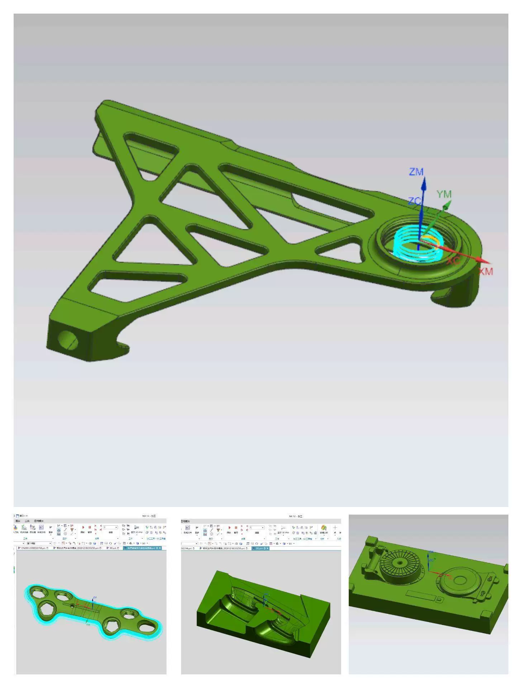
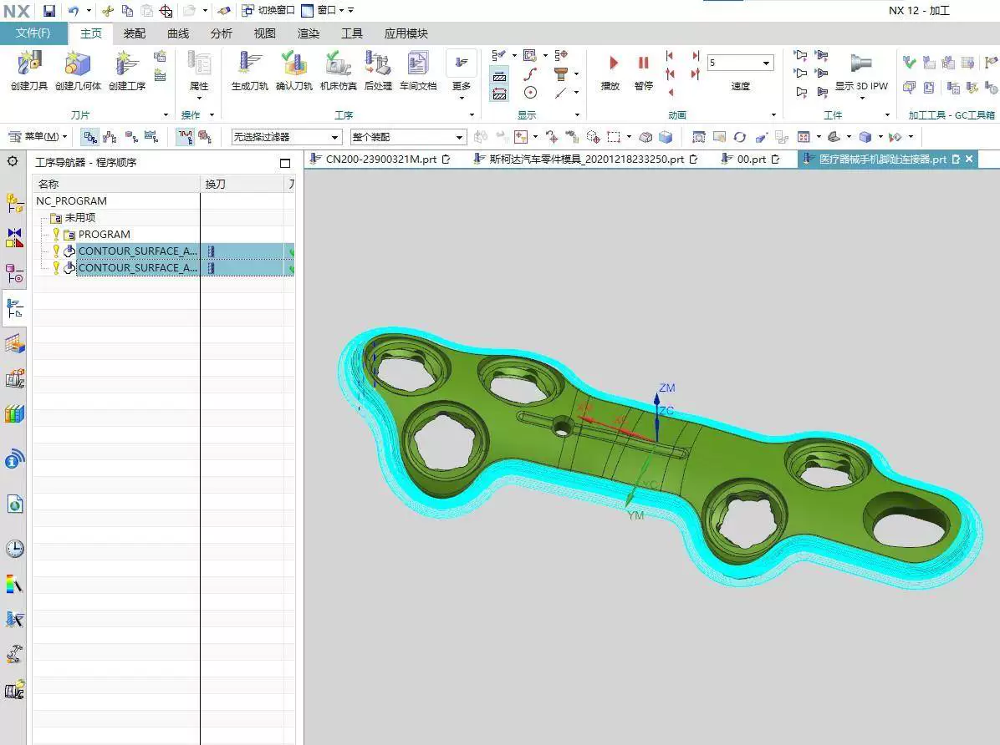
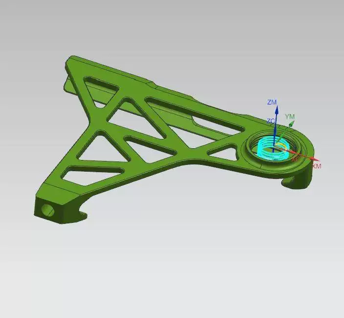
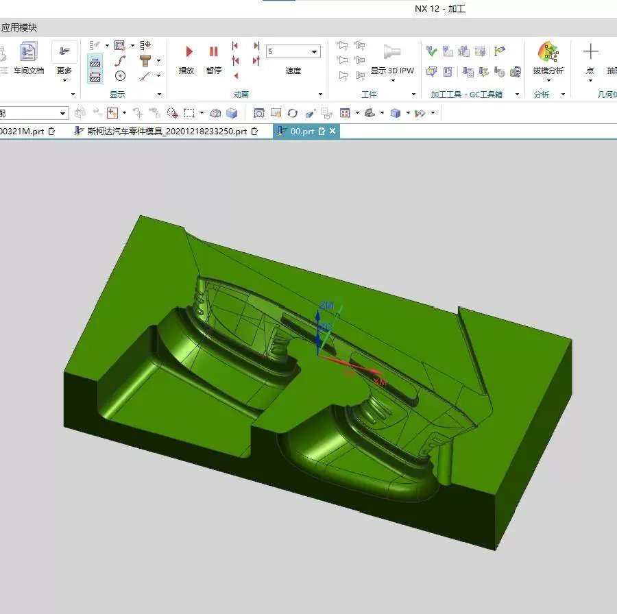
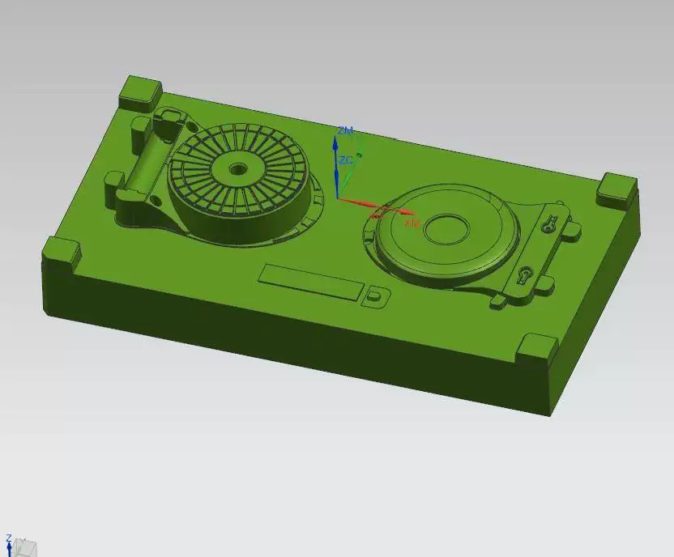
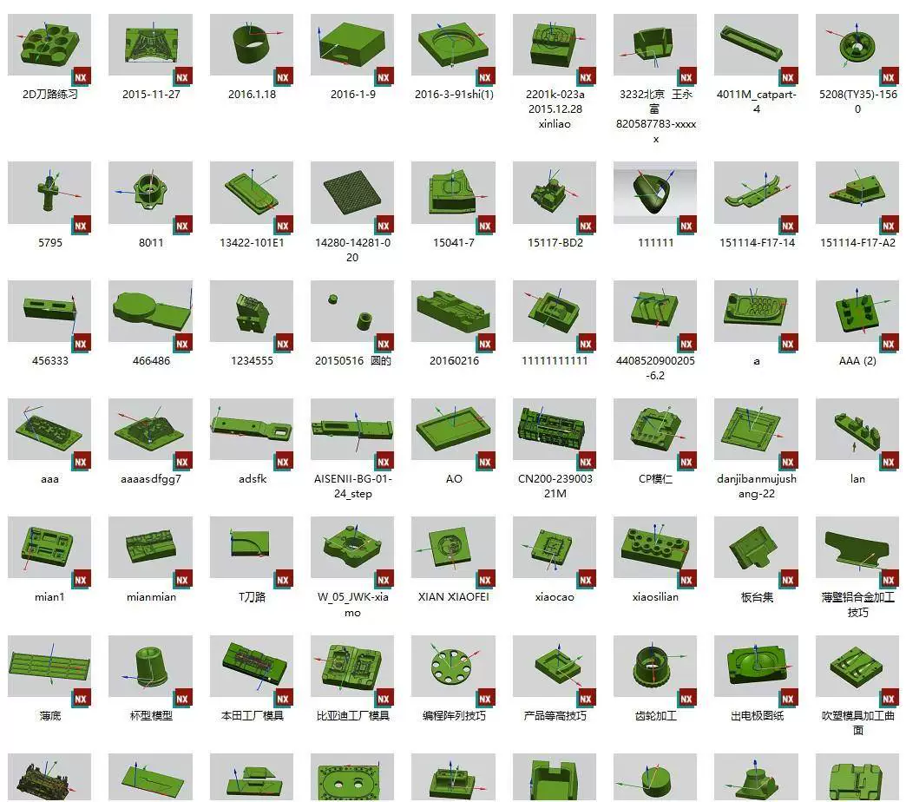
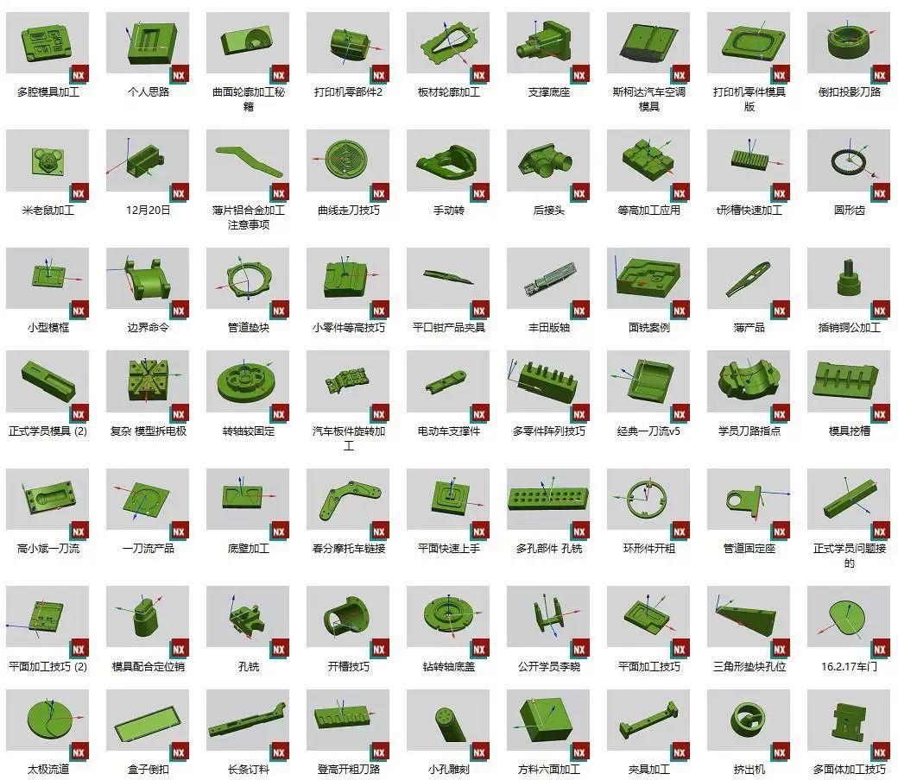
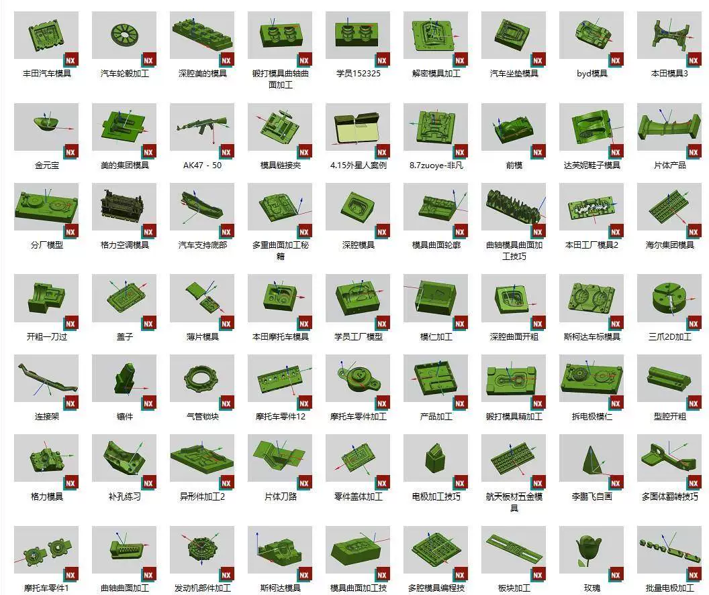

# 500 sets of NXUG12 three-axis programming practice files, CNC machining center fine carving numbers

## Body

500 sets of NXUG12 three-axis programming practice diagrams, CNC machining center fine carving NC machine 3D models 3
500 sets of NXUG12 three-axis programming practice diagrams, CNC machining center fine carving NC machine 3D models 3
500 sets of NXUG12 three-axis programming practice diagrams, CNC machining center fine carving NC machine 3D models 3

500 sets of NXUG12 three-axis programming practice diagrams, CNC machining center fine carving NC machine 3D materials, UG product part case 47

Automatic delivery, instant link.

## Images

## Payment

Here is a pay link on Stripe ( https://buy.stripe.com/3cs8yP7sY87d0vu9AB ). Please contact me lonlonago@foxmail.com after funding $89, and I will send you a complete data files , thank you!

